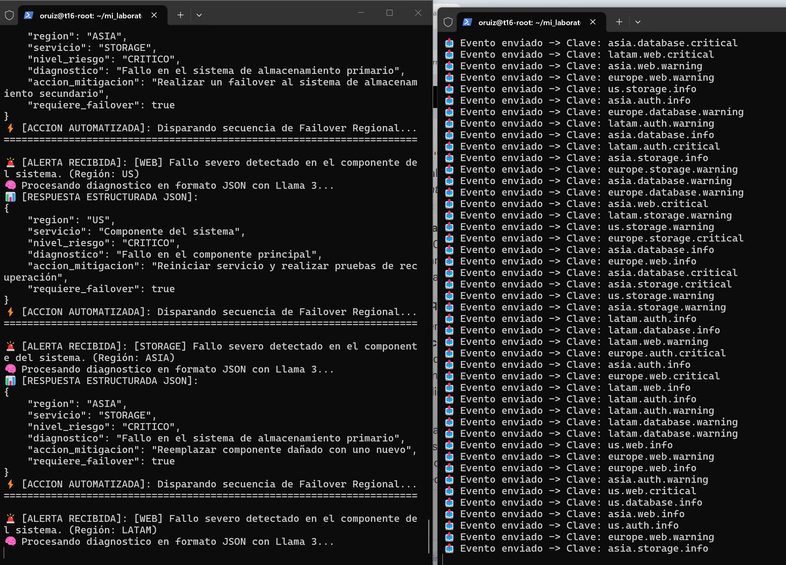

# 🚀 Event-Driven AIOps Platform: Pub/Sub Filtering with RabbitMQ & Local LLM (Llama 3)

An enterprise-grade, distributed event processing and real-time incident remediation architecture decoupled via **RabbitMQ Topic Exchanges** and an **Evaluator Agent powered by a local Llama 3 LLM (via Ollama)**.

This laboratory demonstrates how to process high-volume infrastructure telemetry, filter critical alerts without wasting computational resources, and execute **automated AI diagnosis and self-remediation—completely offline without cloud vendor lock-in or third-party API costs**.

---

## 📐 System Architecture

```text
┌─────────────────────────┐
│  publisher_continuo.py  │  (Infrastructure Telemetry Emitter)
└────────────┬────────────┘
             │ Emits real-time events every 2s via Routing Keys (e.g., europe.database.critical)
             ▼
┌─────────────────────────┐
│   RabbitMQ in Docker    │  (Message Broker w/ Topic Exchange)
└────────────┬────────────┘
             │ Pattern matching & filtering (*.*.critical)
             ▼
┌─────────────────────────┐
│   worker_ai_json.py     │  (Subscriber / AIOps Agent)
└────────────┬────────────┘
             │ Rest API Call on Port 11434 (format="json", temp=0.2)
             ▼
┌─────────────────────────┐
│     Ollama (Llama 3)    │  (Local LLM Inference Engine)
└─────────────────────────┘


Here is a side-by-side terminal session showing the Telemetry Publisher (right) and the AIOps Worker Agent processing critical events in real-time (left):




